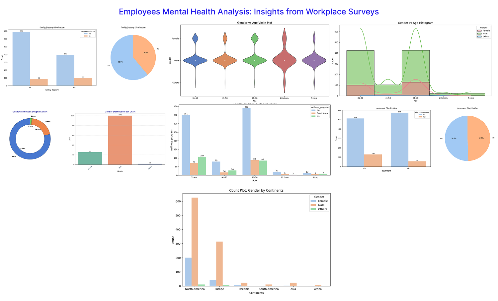

# Employee Mental Health Analysis: Insights from Workplace Surveys

## Project Description
This project delves into the analysis of mental health cases among employees across various organizations, 
The project aims to uncover patterns and correlations that can inform better mental health practices and 
support systems within organizations.

## Data Sources
**Mental Health Survey:** The dataset used in this analysis is a mental health survey from Kaggle, containing responses from employees across various organizations, focusing on their mental health status, workplace stress, and support access.
[Download Here]()

## Tools Used

    
    
    
    
    
    

## Data Understanding
The dataset, which consists of 27 columns, offers a wealth of insights into the mental health status and well-being of employees in diverse work environments. For this analysis, 11 key columns were selected based on their relevance to understanding the factors influencing employees' mental health. These selected features provide critical information regarding employees' mental health conditions, access to support, workplace stress levels, and other factors contributing to overall mental well-being. 

## Data Preprocessing
In the initial data preparation phase, the following tasks were performed:

1. **Data Loading and Inspection:** The dataset was loaded and initially inspected for understanding its structure and key features.

2. **Handling Duplicate Values:** Any duplicate rows were identified and removed to ensure the integrity of the data.

3. **Handling Missing or Erroneous Values:** Missing or erroneous values were addressed using appropriate strategies, such as imputation or removal, depending on the nature of the data.

## Exploratory Data Analysis
We shall be exploring the dataset in search for answers to the following key questions:

- **What is the distribution of mental health patients by gender?**
- **What is the distribution of mental health cases by region?**
- **What’s the effect of family on people’s mental health?**
- **How many patients have successfully been treated and are undergoing treatment?**
- **What is the company’s approach to reducing mental health issues?**

## Findings/Results
From the analysis, the following key insights were observed:

- Regional Distribution: The highest number of mental health cases are reported from North America, indicating a potential regional trend in mental health concerns.
- Gender Differences: Mental health issues appear to be more prevalent among men, suggesting a gender-based disparity or a potential underreporting of mental health among women.
- Family History: A significant proportion of respondents do not have a history of mental health issues in their families, pointing to other factors influencing their mental health.
- Gender Bias in Participation: The survey responses show a higher proportion of male respondents, which may indicate either a gender bias in the data or a higher level of participation from male employees.

## Challenges Ecncountered
Some of the challenges encountered while carrying out this project include:

- **Handling Missing Values:** Properly imputing missing data without introducing bias.
- **Feature Engineering:** Creating meaningful features from raw data to improve model accuracy.
